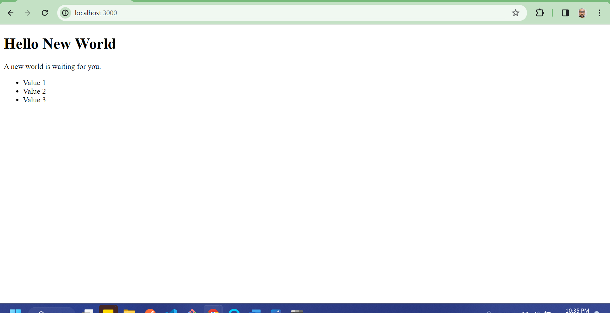
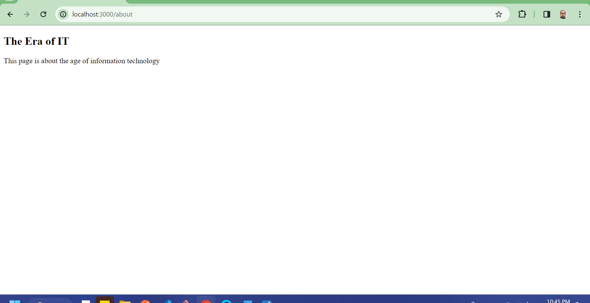

# Next.js Assignment

## Objective
The aim of this assignment is to get familiarized with the Next.js framework by creating a simple project and learn to set up a new Next.js application, explore its file structure, and create a basic page. This introduction will help understand how Next.js combines the power of React with additional features like server-side rendering and static site generation.

## Instructions
### Part 1: Setting Up Next.js Project.
Create a New Next.js Application:

- Run npx create-next-app@latest you-name-here in the terminal, replacing your-project-name with the desired name of the project.
- Navigate into your project directory using cd your-project-name.
### Explore the Project Structure:

- Open the project in your preferred code editor and familiarize yourself with the file structure, especially the app and public directories.
### Part 2: Creating Your First Page
Modify the Home Page:

Navigate to src/app/page.js.
Replaced the existing content with a simple custom message.

## Add a New Page:

- Create a new file in the app directory named about.js.
- In about.js, create a functional component that returns a brief about me page or any content you prefer.
### Part 3: Running Your Application
- Started the Development Server:
- Ran npm run dev in your terminal to start the development server.
- Opened the browser and navigate to http://localhost:3000 to view home page, and http://localhost:3000/about to view about page.
## Part 4: GitHub Repository Setup
### Initialize a GitHub Repository:
- CREATING A NEXT APP CREATES A LOCAL REPO, SO WE PUSHED OUR REMOTE CODE TO GITHUB, NOT CLONED IT DOWN.

 - FOR THAT WE CREATED NEW GITHUB REPO WITHOUT A README ND PUSHED THE CODE TO THE REPO BY ACP TO UPDATE THE REPO
 

## Homepage Screenshot:

## About page Screenshot:



This is a [Next.js](https://nextjs.org/) project bootstrapped with [`create-next-app`](https://github.com/vercel/next.js/tree/canary/packages/create-next-app).

## Getting Started

First, run the development server:

```bash
npm run dev
# or
yarn dev
# or
pnpm dev
# or
bun dev
```

Open [http://localhost:3000](http://localhost:3000) with your browser to see the result.

You can start editing the page by modifying `app/page.js`. The page auto-updates as you edit the file.

## Learn More

To learn more about Next.js, take a look at the following resources:

- [Next.js Documentation](https://nextjs.org/docs) - learn about Next.js features and API.
- [Learn Next.js](https://nextjs.org/learn) - an interactive Next.js tutorial.
